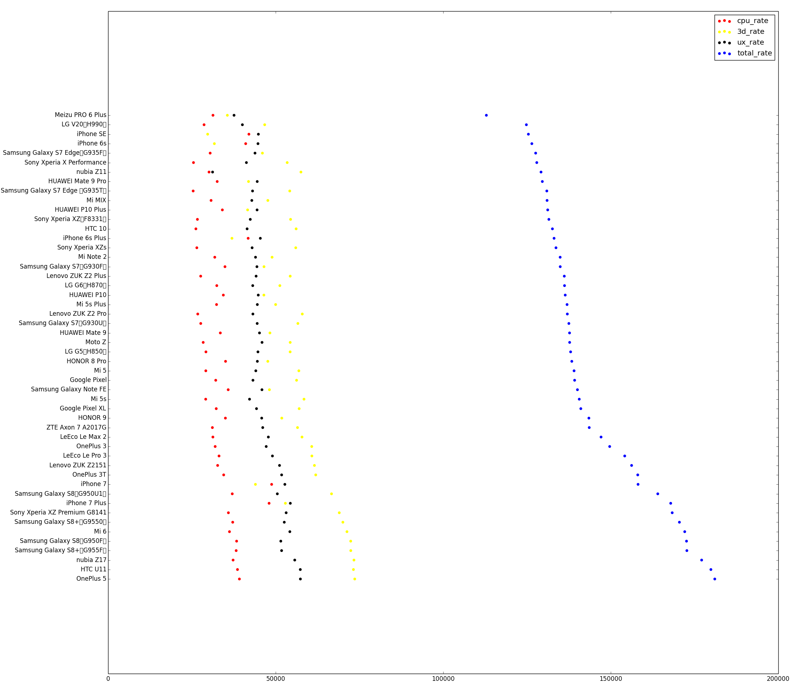

# Antutu Ranking Plotter

Because I found that this performance ranking may help me to buy a new phone, I made these easy to use scripts :

1. Inject `antutu_chart.js` into [antutu benchmark](http://www.antutu.com/en/ranking/rank1.htm) page (within any web explorer developper tools)
2. Run `get_chart_data` and write stringified returned value into a `json` file
3. Run `chart.py filename.json` and open `filename.json.png` and visualise the chart

Below is the resulting plot for semptember 2017

